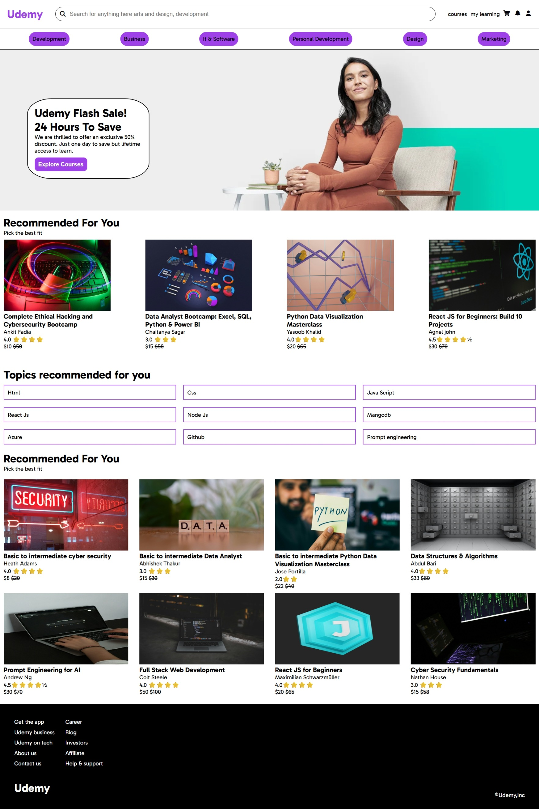

# Udemy Clone (HTML & CSS)



This project is a **Udemy homepage clone** built using **HTML and CSS**. The goal of this project was to practice webpage layout design and understand how modern websites are structured.

## Features

* Navigation bar with search input and icons
* Course recommendation section
* Popular courses section
* Topics recommendation tags
* Promotional banner image
* Footer with links
* Flexbox-based layout

## Technologies Used

* HTML5
* CSS3
* Flexbox
* Google Fonts
* Font Awesome Icons

## Learning Outcomes

Through this project I learned:

* How to structure a full webpage using HTML
* How to style components using CSS
* Using **Flexbox** for alignment and layout
* Creating reusable **course card components**
* Designing a simple **responsive page layout**

## Project Structure

```
udemy-clone/
│
├── index.html
├── style.css
└── images/
    ├── basic cyber security.jpg
    ├── basic data analysis.jpg
    ├── basic python.jpg
    ├── cyber security fundamentals.jpg
    ├── cyber security.jpg
    ├── data analysis.jpg
    ├── Data structure.jpg
    ├── fullstack.jpg
    ├── js.jpg
    ├── output.jpeg
    ├── Prompt engineering.jpg
    ├── python.jpg
    ├── react.jpg
    └── saleimage.jpg
```

## Author

Created as a practice project while learning **HTML and CSS**.
